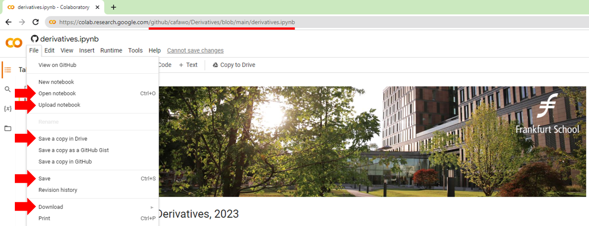

# Derivative

[**Prof. Dr. Fabian Woebbeking**](https://woebbeking.info/)</br>
Assistant Professor of Financial Economics

IWH - Leibniz Institute for Economic Research</br>
fabian.woebbeking@iwh-halle.de


## Course materials

Website for this course: http://elearning.vgu.edu.vn/goto.php?target=fold_33044

GitHub repository: https://github.com/cafawo/Derivatives

During the class, we will focus on the script (Jupyter Notebook) in [Derivatives/derivatives.ipynb](https://github.com/cafawo/Derivatives/blob/main/derivatives.ipynb). There are three easy peasy ways to follow along:

1. The convenient way: instead of installing Python locally on your system (e.g. because you are using an iPad), you can use [Google's Colab HERE](https://colab.research.google.com/github/cafawo/Derivatives/blob/main/derivatives.ipynb).  (CAREFUL, there are some caveats when saving your changes, see further  [information HERE](https://colab.research.google.com/github/googlecolab/colabtools/blob/master/notebooks/colab-github-demo.ipynb))

2. The pro way: clone this Git repository in order to **locally** follow along in Python/Jupyter. This requires a Python distribution on your local system. If you don't have one, check out [Anaconda HERE](https://www.anaconda.com/products/individual).

3. The ancient way: use the static [HTML version HERE](https://cafawo.github.io/Derivatives/derivatives.html). This, however, will not allow you to play with the codes.


## Working with Google Colaboratory (Colab)

> "Colaboratory, or “Colab” for short, is a product from Google Research. Colab allows anybody to write and execute arbitrary python code through the browser, and is especially well suited to machine learning, data analysis and education. More technically, Colab is a hosted Jupyter notebook service that requires no setup to use, while providing access free of charge to computing resources including GPUs." [(Google, 2023)](https://research.google.com/colaboratory/faq.html)

During the class, we will focus on: 

[https://colab.research.google.com/github/cafawo/Derivatives/blob/main/derivatives.ipynb](https://colab.research.google.com/github/cafawo/Derivatives/blob/main/derivatives.ipynb)

You can view and execute the code in derivatives.ipynb, however, as you do not have write access to the GitHub repository, you have to **manually save a copy** in order to keep your own changes.

> Any time you open a GitHub hosted notebook in Colab, it opens a new editable view of the notebook. You can run and modify the notebook without worrying about overwriting the source.
>
> If you would like to save your changes from within Colab, you can use the File menu to save the modified notebook either to Google Drive or back to GitHub. Choose File→Save a copy in Drive [...].
> [(see Google, 2023)](https://colab.research.google.com/github/googlecolab/colabtools/blob/master/notebooks/colab-github-demo.ipynb#scrollTo=8J3NBxtZpPcK)




You can open a different Jupyter notebook, simply by changing the Colab link, e.g.:

[https://colab.research.google.com/**github/cafawo/Derivatives**/blob/main/**cases/1_warmup.ipynb**](https://colab.research.google.com/github/cafawo/Derivatives/blob/main/cases/1_warmup.ipynb)


## Working with Git / GitHub

Git is a free and open source distributed version control system [(see Git, 2023)](https://git-scm.com/).


In order to work with Git locally, you need to install it first: 
* https://git-scm.com/downloads
* https://anaconda.org/anaconda/git

Some source-code editors come with build-in Git capabilities or can be extended (e.g. Microsoft's Visual Studio Code). 

### Connecting to the remote repository

After installing git, you can `clone` the course repository to your local system:

```Bash
git clone https://github.com/cafawo/Derivatives.git
```

Once you have a local copy of the repository, you can `pull` updates (Git does not synchronize automatically). 

```Bash
git pull
```

Careful: Git tries its best to merge the remote with the local repository, however, might fail if the two repositories are too diverging.

### Working locally with git

Your local repository is essentially a folder on your local file system. Changes made in that folder can be committed to the (local) git repository. 

First, "stage" your changes - this is sth. like a pre-commit:

```Bash
# The '*' adds all changes made in your folder (you could be more selective)
git add *
```

Second, commit your staged changes to the local repository:
```Bash
git commit -m 'Commit message'
```

Finally, you can push your committed changes to the remote:
```Bash
# This only works if you have write access to the remote
git push
```

### More on Git

Git itself offers a wide range of capabilities that are useful for code versioning and collaboration. Much much more than we need for this class. If you want to learn more:
* About Git itself: https://git-scm.com/about
* Getting started (videos, tutorials): https://git-scm.com/doc
* Working with GitHub (remotes): https://skills.github.com/


## Contribute

If you want to contribute to the material in this repository, e.g. fix bugs and errors, please send a [pull request](https://github.com/cafawo/derivatives/pulls) via Git. This will yield you a place in the hall of fame at https://github.com/cafawo/derivatives/graphs/contributors
